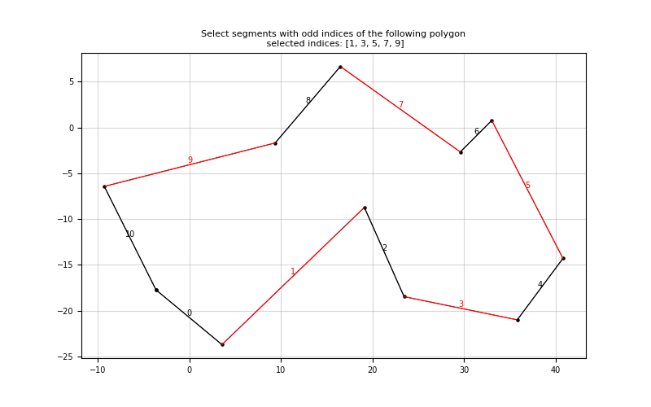

# segment-selector

A naive polygon segment selection test using [OpenAI Agents SDK](https://openai.github.io/openai-agents-python/) function calling for prompt-based segment selection. The repository explores possibilities for AI-assisted geometric task.

<br>

<div style="display: flex">
    
    
    
</div>
<br>
<p align="center" color="gray">
  <i>Selected Segments by Agent</i>
</p>

# Installation

This repository uses the [image](/.devcontainer/Dockerfile) named `python:3.12` for running devcontainer.

1. Ensure you have Docker and Visual Studio Code with the Remote - Containers extension installed.
2. Clone the repository.

    ```
    git clone https://github.com/PARKCHEOLHEE-lab/segment-selector.git
    ```

3. Open the project with VSCode.
4. When prompted at the bottom left on the VSCode, click `Reopen in Container` or use the command palette (F1) and select `Remote-Containers: Reopen in Container`.
5. VS Code will build the Docker container and set up the environment.
6. Once the container is built and running, you're ready to start working with the project.

<br>

# File Details

### src
- `selector.py`: Implementation of the segment selector agent
- `plotter.py`: Visualizer for selected segments
- `testsets.py`: Test cases with polygon boundaries and selection prompts
- `main.py`: Entry point for running the segment selector

### runs
- `Testcase*.png`: Visualization results of different test cases

<br>


# How to run

1. Set up OpenAI API key:
   ```
   export OPENAI_API_KEY=your_api_key
   ```

2. Run the main script:
   ```
   python segment_selector/src/main.py
   ```

3. Adding New Tools:
   - Use `@function_tool` decorator to add new tools for the agent
   - Define static methods in `SegmentSelector` class to automatically register tools

4. Configuration:
   - Adjust hyperparameters in `SegmentSelectorConfiguration` class
   - Modify model settings in `MODEL_SETTINGS` for different behaviors
